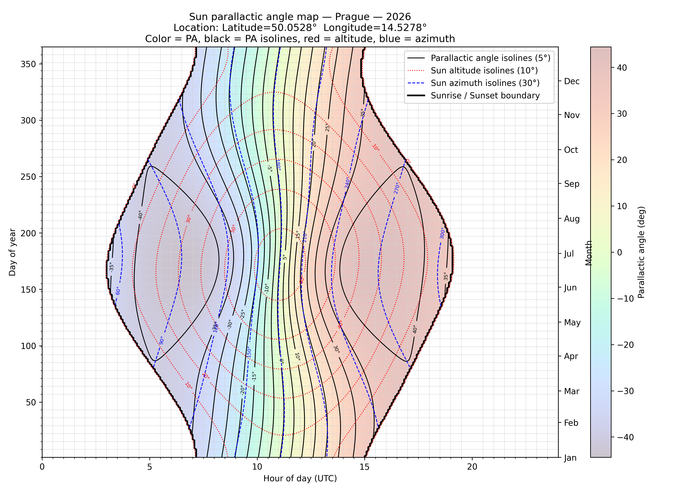

# SunSpotter

Processing images of the Sun taken with the Dwarf 3 telescope

## work in progress ...

## Somehow finished

### sun_parallactic_angle

generates map of parallactic angle of Sun for given location 

{width=70%}

## Ideas what to develop

### Load of source images to SunSpotter working area

1. select all stacked images (.fits) of Sun from master Dwarf3 directory
    - parameters of selection: exposure date range

2. load of identified source images the to working area
    - parameters of image loading:
        - database location of source images
        - master Dwarf3 directory [data/dwarf3]
        - working area directory  [data/sunspotter/source]
        - backup directory  [data/dwarf3/sunspotter/backup]
    - optionally move processed Dwarf3's subdirectories to backup location

3. load generates/updates database of stacked images
    - table: IMAGE_LOAD
        - source image name (friendly name of source fits file)
        - date/time of exposure (UTC?)
        - filter
        - source image directory
        - source image file
        - number of images stacked
        - number of shots taken
        - exposure data (shutter,gain, filter, temperature)
        - location of exposure (?)
        - image dimensions

4. generate contact sheet of source images with labels consist of date filter
    - define number of row/columns on the contact sheet

### Crop and rotate source images

1. select source images to be processed
    - parameters of selection:
        - exposure date range
        - filter
        - source image name list

1. calculate angle correction based on Sun parallactic angle
    - parameters:
        - date/time of exposure (UTC)
        - location of exposure (?)

1. for selected source images
    - parameters:
        - Sun center identification process values
    - find Sun center + radius in the source image
    - rotate image  by -(Sun parallactic angle) around Sun center
    - crop image to predefined size
    - save cropped images to crop directory [data/crop]
    - update table: IMAGE_CROP
        - source image name (friendly name of source fits file)
        - cropped image name (friendly name cropped file)
        - date/time of exposure (UTC?)
        - filter
        - Sun center
        - Sun radius
        - Sun parallactic angle
        - cropped image dimensions

1. generate contact sheet of source images
    - contact sheet with labels consist of
        - date
        - filter
        - Sun center and radius
        - parallactic angle
    - define number of row/columns on the contact sheet

### Identify Sun spots

1. select cropped images to be processed
    - parameters of selection:
        - exposure date range
        - filter
        - source image name list

1. identify sunspots for selected cropped images
    - table: SUN_SPOT
        - source image name (friendly name of source fits file)
        - exposure date/time (UTC)
        - filter
        - number of spots
        - spots area

    - table: SUN_SPOT_DETAIL
        - source image name (friendly name of source fits file)  
        - spots center coordinates
        - spot area
        - spots rectangle

    - table: SUN_SPOT_MASK
        - source image name (friendly name of source fits file)  
        - spots mask

### Preprocess cropped images

1. select cropped images to be processed
    - parameters of selection:
        - exposure date range
        - filter
        - source image name list

2. enhance cropped image

### Show Sun spots

1. select cropped images to be processed
    - parameters of selection:
        - exposure date range
        - filter
        - source image name list

1. plot spots on enhanced cropped images

## Ideas what to try

- where to check Sun parallactic angle ?
- spot naming using some external data ?
- how to combine image data from VIS and DUALBAND filter
- process Sun edge for flares ???
- shots taken + stacked
- is it possible to generate exe file that will include python source ?
